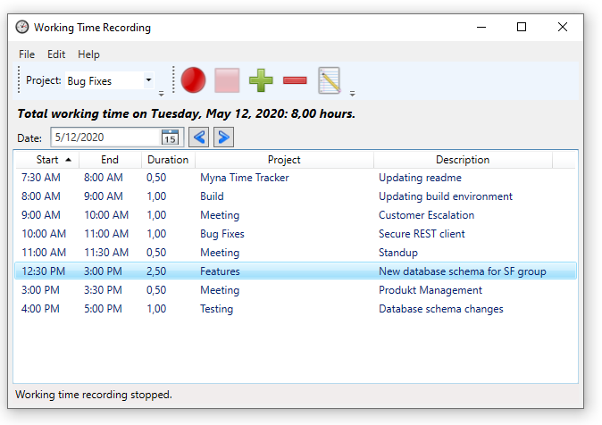
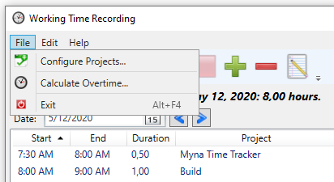
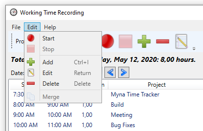
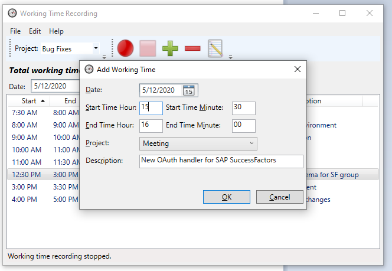
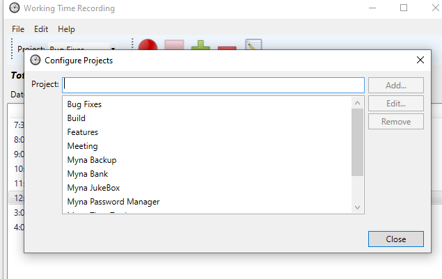
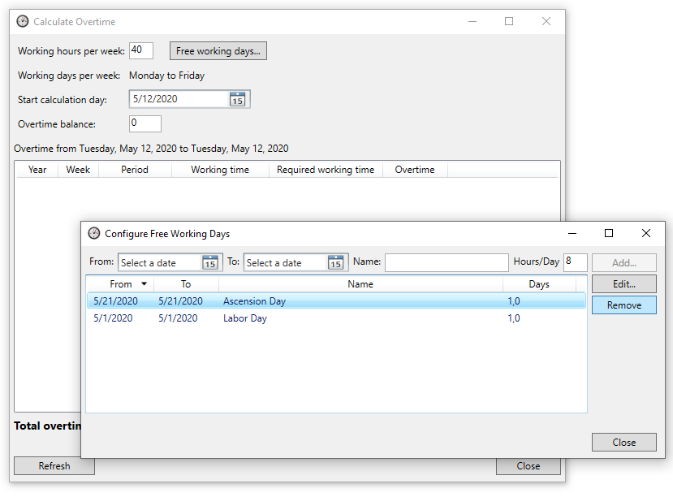

# MynaTimeTracker

## Overview

An application that allows to record and manage working times for Windows using WPF.

## Installation

The program requires .NET 8.

## Screenshots

### File Menu Item

### Edit Menu Item

### Add Working Time

### Configure Projects

### Overtime Calculation

## Licenses

The following icons are used from the **Open Icon Library** (https://sourceforge.net/projects/openiconlibrary):

application-exit-5.png / nuovext2 / LGPL-2.1 
arrow-left-2.png / nuvola / LGPL-2.1 
arrow-right-2.png / nuvola / LGPL-2.1 
document-properties-2.png / gnome / GPLv2 
edit.png / gimp / GPLv2 
edit-history.ico / intrigue / GPLv2 
edit-history.png / intrigue / GPLv2 
list-add-4.ico / oxygen / CC-BY-SA 3.0 or LGPL 
list-remove-4.ico / oxygen / CC-BY-SA 3.0 or LGPL 
media-playback-stop-7.png / nuvola / LGPL-2.1 
media-record.png / intrigue / GPLv2 
task-new.png / oxygen / CC-BY-SA 3.0 or LGPL 

